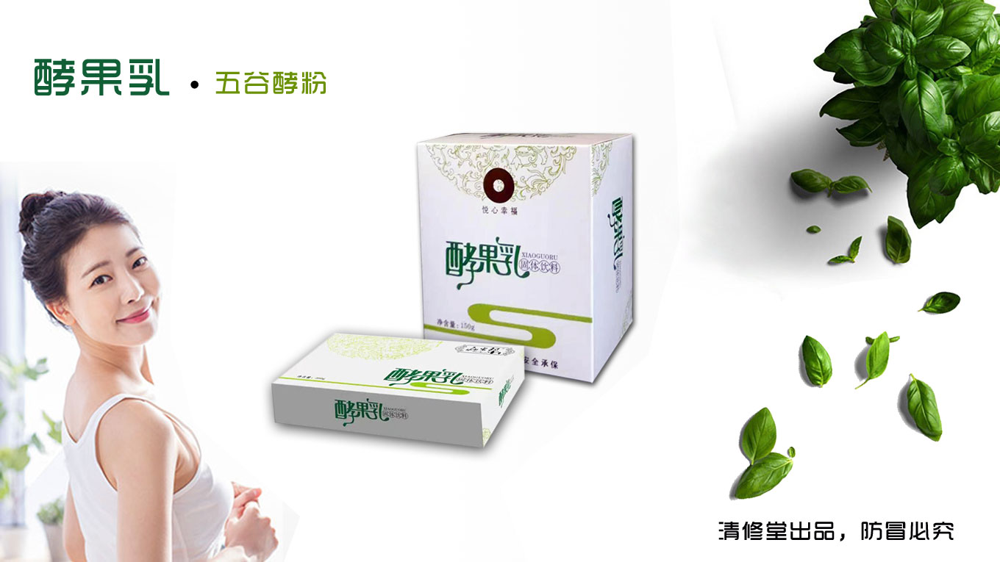

# 酵果乳排毒知识问答

## 1. 怎样判断自己该排毒?
若你有以下的问题，便显示你是可能身体机能排毒功能不足，或你所吸收的毒素太多，超过身体排毒功能所负担，你需要排毒了:  
(1)经常伤风感冒  
(2性或偶发性便秘  
(3)头痛腰背和关节痛  
(4)心跳过速、心绞痛  
(5)失眠焦虑、抑郁  
(6)皮肤出现斑点  
(7)容易疲倦有口气和体  
(8)恶心、呕吐、腹泻  
(9)皮肤过敏、暗疮粉刺、湿疹  
(10)咳嗽、气管敏感哮喘  
(11)神经紧张、食欲不振  
(12)流眼水耳鸣  
这些都是毒素过多的征兆，是身体发出的警号，如果仍不加以改善和排毒，便会引一系列的严重疾病。

## 2. 正常人要不要排毒?
正常人是指现在身体还没有出现异样的感觉，自我感觉很健康，但是现在国内环境污染、饮食安全、营养不均衡、生活压力大且不规律等等原因使我们防不胜防，所以正常人，自我感觉良好的人也要排毒。以免体内毒素堆积过多，影响健康，就像宋美玲、戴安娜王妃都会每周选择一次排毒，毛主席平时也接受排毒治疗，这些都是显示出“正常人”排毒的重要性。

## 3.为什么慢性病要先排毒?
如高血压、冠心病、糖尿病等，这些慢性病患者常年大把大把的服药，却并不一定能把病治好。肝脏是人体最大的解毒脏器，肾脏是排毒器官，长年服药使这两个器官承受不了，解毒的不能完全解毒，排毒的不能全部排毒，再加上食物添加剂，水源污染，致病因子来源多元化，更加重了肝肾的负担。所以导致慢性病越来越不易好转。用乳糖饮能把“毒素”清理干净，使肝肾免受其害，慢性病再配合刮莎、服药等，效果会更好。

## 4.乳酵果乳与其他排毒产品的区别？
(1)服用药物:例如果导、麻子仁丸、大黄、芒硝、巴豆、番泻叶等，优点是简单方便，缺点是会影响肠道本身的正常蠕动功能，产生依赖性，甚至导致肠道功能完全瘫痪。  
(2)灌肠:优点是排毒比较彻底，缺点是操作极其麻烦，且多数需要两人才能完成，操作不当的话极易对肠道造成人为损伤，也会对肠道内的正常菌群有一定破坏。  
(3)排毒的保健品:如排毒养颜胶囊等，大部分的保健品都打着绿的清肠排毒的旗号掺杂有药物的成分，例如这类产品服用后都会在排便时伴有腹痛、气坠等感觉，这就是药物成分刺激肠道的表现。长时间服用一定会破坏肠道内的正常菌群，并且极易产生依赖性。  
(4)酵果乳不是药品或保健品，其中的乳糖是包含在人类乳汁之中的“天然食品”，是婴幼儿生长发育必不可少的物质。其排毒原理是利用人体自身特性，调动人体自身物质(水液、二氧化碳等)来进行排毒，就如“原汤化原食’一样没有任何副作用，亦不会产生依赖性，是极其安全的排毒食品。  

## 5.服用酵果乳为什么要多喝水，为什么会感觉口渴?
酵果乳中的乳糖本身是一种易溶于水的物质，在人体缺少乳糖酶来分解乳糖的情况下，身体会调集大量水液来对其进行中和;再加之酵果乳中含有啤酒酵素等酵素，啤酒酵素在遇水后会释放出大量二氧化碳来辅助排毒，在这个过程中也需要消耗部分水液，人体自身会消耗很多水液，在加上又有部分被肠道消耗，机体需要更多的水液来维持体内的水液平衡，因此会出现口渴的现象;在服用酵果乳排毒期间多喝水，能保证酵果乳的功效，更能促使血液中水液的交换，加速毒素排出，使毒素排出更加彻底。

## 6. 服用酵果乳后的正常反应?
a、大便青黑色:肠道内毒素较多，应坚持服用。  
b、大便粘稠:肠道内湿毒较多、或肠道本身有病变c、腹部微痛:说明肠道内有炎症，不必担心，坚持服用酵果乳并加强刮莎。  
d、疼痛剧烈或绞痛:肠道内恶性病变的反应，建议尽快到医院检查。  
e、小便粉红色，人体血液中毒素排出的现象。  
f、像石灰一样白色的大便:大肠有功能障碍性疾病，建议配合刮疹等外治。  
g、脓血便:溃疡性结肠炎或肠道内有疾杆菌。  
h、女子下腹部疼痛:建议到医院检查是否子宫肌瘤。  
i、类球装大便:考虑肠道息肉。  

## 7. 服用酵果乳拉肚子和吃泻药拉肚子是一回事吗?
吃乳糖饮和吃泻药都可以引起拉肚子的现象，但泻药在肠内只是靠药理毒性“蛮力”增加肠蠕动，排出水便，排便的同时总是还伴有腹痛，下坠感明显，小便次数减少等，药物成分使肠道蠕动过度必会伤津耗气使患者感到少气乏力，全身不适; 吃酵果乳拉肚子则没有以上情况，因为其中的乳糖本身就是人体生长发育过程中必不可少的成分，其内含有补的成份(多种人体必需的热量及能量)，它是“攻补兼施”的排毒，所谓“祛邪而不伤正’正是如此，虚证、实证都可以用。实际运用当中，很多人向我们反应，服用酵果乳后，有时虽然排便的感觉非常强烈，但是若有事耽误一下什么的，感觉也就慢慢减弱下来了，也就是乳糖引起的排便干事可以轻易忍过去的，不会出现很强烈的肚子痛而忍不住的情况，而药物则做不到。

## 8. 拉肚子还能吃酵果乳吗?
拉肚子有些是细菌、病毒或食用的腐坏食物在肠道内作怪，使肠蠕动增加，越拉越重，甚至可以出现脱水症，电解质紊乱，出现休克。酵果乳经水中和后会分解出一部分乳酸，乳酸对肠胃有调整保护作用，它能抑制肠内异常发酵产生的毒素造成的中毒现象，还可抑制肠内有害细菌的繁殖，因此治愈或减轻拉肚子的症状。另则若是因为误食腐坏食物引起的拉肚子，服用酵果乳后能加速腐坏事物的排出，减少其在胃肠道中的停留时间，避免或减轻其引起的拉肚子，避免饮过度腹泻引起的其余继发症状。

## 9. 服用酵果乳会影响正在吃的药物吗?
服用排毒食品可以继续服用正在吃的药物，两者是不会产生冲突的。特别是治心脏病的药，不能停，可以早晨6点吃排毒食品，然后后推两个小时，到8点~10点再吃治病药。中午、下午按原来服药时间服即可。

## 10. 服用过酵果乳后恶心反胃是怎么回事?
酵果乳呈弱碱性，胃酸属强酸性，加之乳糖空腹时服用效果最佳，这就导致碱性的酵果乳遇到酸性的胃液而发生强烈的酸碱中和反应，在这过程中胃体本身会出现相对强烈的收缩、蠕动(不同的人体反应强弱也不一样)，从而出现恶心或反胃的情况，亦属正常反应。此种情况可以减量服用，也可以改变酵果乳的服用方法，如用酸奶或粥冲服等。

## 11. 服用过酵果乳有些头痛是怎么回事?
部分患者服用过酵果乳会有轻微的头痛或头晕的症状，不排除该患者有低血糖、低血压等症的可能。因为在大量排便的过程中不可避免的会造成血糖或血压的下降，在血糖或血压不就不好的情况下，就会引起头痛或头晕的症状出现。或是患者对酵果乳气味过敏，也会引起头痛或头晕的症状。

## 12. 服用过酵果乳肚子痛是怎么回事?
肠炎、肠梗阻、肠息肉、肠套叠等，在服用完乳酵果乳后由于会促进肠道加速蠕动，若服用者本身有上诉病症，则可能会出现肚子痛，对于服用后有腹痛或腹痛剧烈的，我们建议可先去医院检查身体，如若是器质性病变，要系统进行治疗，如若是功能性病变，可先刮痧再服用酵果乳。市场中也有服用酵果乳后腹痛，到医院检查从而发现了原来没有发现的疾病。

## 13. 为什么酵果乳既能减肥又能增胖?
由于多种因素引起肠道污染，长期积存“宿便”使脂肪和糖不能按正常生理机能燃烧和吸收，引起了肥胖和消瘦。服酵果乳能及时排出肠道“宿便”，促进脂肪燃烧,可以起到很好的减肥作用。肠道中的宿便和附着的油脂等被排出体外后，肠道对饮食物带来的营养吸收就更充分了，因此既能减肥又能增胖，酵果乳有双重作用。

## 14. 酵果乳是药吗?
酵果乳不是药，而是一种排毒食品，但常服对很多疾病都有很好的治疗效果，是因为酵果乳能够清理肠道，清除人体各部位毒素，即“肠道清则百病无’。

## 15. 服用酵果乳能美容吗?
可以，因为面部的健康状况是人体内部五脏六腑、气血盛衰状况在外的综合反映，服用酵果乳可以排毒，能排出肠道、血液及五脏六腑的毒素与垃圾，调节人体五脏六腑的生理功能，加速营养的吸收，使气血平和清净，血气充足则面色红润有光泽，皮肤富有弹性。

## 16. 为什么排毒对皮肤病有好处?
因为有相当一部分皮肤病是因为血液及脏腑中毒素堆积太多而上浮体表造成的，酵果乳可有效排除机体各部位毒素，将皮肤疾病的根源去除，皮肤病自然会很快愈合;再如糖尿病引起的皮肤癌痒，脚癣是真菌所致，是棒状杆菌感染等，治病应求其本，所有皮肤病患者，肠道都有废物，如不及时清除，皮肤病治愈很难。

## 17. 三高(五高)病人为什么要排毒?
我们通常所说的三高(五高)高体重、高血脂、高血压、高血糖、高尿酸，即人们所说的富贵病，常因贪吃肥甘厚味之品，大量的油脂会沉着在血管壁上，即高血脂长此以往不注意改善和治疗还会引起高血压和高血糖。服用酵果乳能够清理肠道，净化血液，清除血管壁上沉着的毒素，改善血管的通透性，逐步改善三高症状，直至将三高消除。

## 18. 服用酵果乳会引起胃出血吗?
不会!酵果乳适用于大部分人群，但若患有严重上消化道溃疡尤其是胃及十二指肠溃疡的患者禁止服用，因为酵果乳中的啤酒酵素等酵素会在胃、肠中会产生二氧化碳，形成大量气泡，使胃肠内壁膨胀，胃肠壁变薄，增加胃肠蠕动，有增大溃疡面的风险，一旦溃疡面增大则会引起胃部不适。

## 19. 为什么服用后效果不明显?
出现这种情况一般有三个方面的原因:
1、患者自身含有分解乳糖的乳糖酶，把酵果乳中的有效成分分解掉了，亚洲有3%5%的人自身含有乳糖分解酶。  
2、服用过酵果乳之后喝水不够，不能使酵果乳在肠道中中和而发挥全部作用。  
3、冲服酵果乳的水温太热，把酵果乳自身的有效成分破坏了。  

## 20. 哪些人不适合服用酵果乳?
1、体质特别虚的人不适合服用;  
2、重度胃肠病患者(如胃疡、胃癌、肠梗阻等)不适合服用。  

## 21. 部分人喝了酵果乳没有反应是怎么回事?
成年亚洲人中有95%存在“乳糖不耐受’，但还是有将近品的人是不存在乳糖不耐受’的，因此这一部分人服用酵果乳之后反应不明显或完全没有反应，而这种情况在欧洲或非洲会更为明显，调查显示只有70%的成年黑人、10-15%的成年白人存在“乳糖不耐受’正是由于有部分人服用酵果乳之后没有反应，恰恰证明了我们的酵果乳中绝不含有药物(泻药)成分和化学成分，因为一旦含有上述成分，顾客服用后就100%会出现“腹泻”等反应。

## 22. 喝了酵果乳后腹胀是怎么回事? 怎么办?
酵果乳中本身含有酵素成分，如啤酒酵素，这些酵素被肠道分解并与水融合后会产生大量的气体(002)，这些气体可以与肠道中的水液一起对肠道进行涤荡与冲刷，加强排毒效果。但是如果肠道通畅度太低，这些气体无法及时排出，就会出现“腹胀’的现象，此时只要配合揉腹手法对腹部进行按摩很快就会将气体排出。(可用右手2-4指轻压腹部打圈按揉，方向按照升结肠-横结肠-降结肠-乙状结肠-直肠的顺序)

## 23. 糖尿病人可以喝酵果乳吗?
糖尿病人是可以服用酵果乳的，糖尿病是血液中的“多糖’由于缺少“胰岛素’无法被分解成“单糖’，造成血液中大量多糖堆积而出现的一系列症状，而酵果乳中的乳糖恰恰是单糖的一种，服用后不但不会出现使血糖增高的情况，反而会有利于糖尿病人的外周血管与皮肤。

## 24. 服用酵果乳能排结石吗?
服用酵果乳是可以排结石的，但相对来说对泥沙型的结石效果最好。

